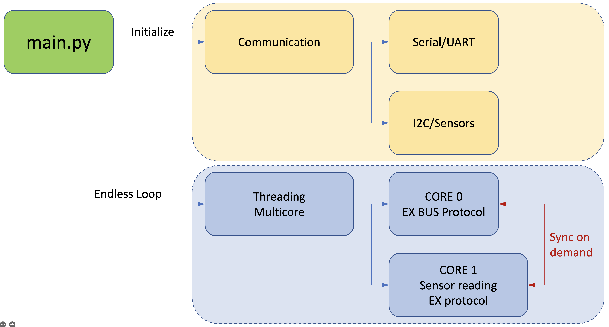
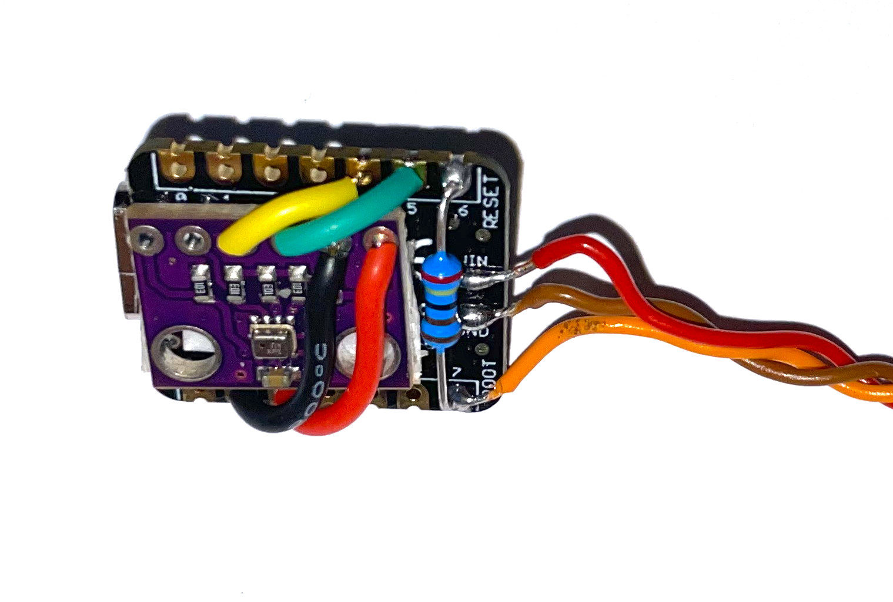
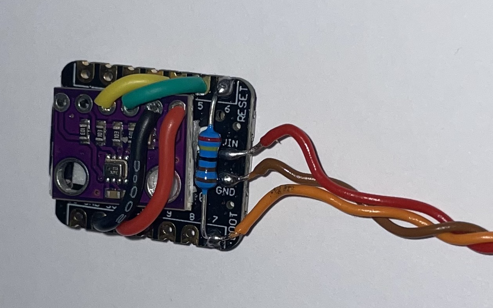
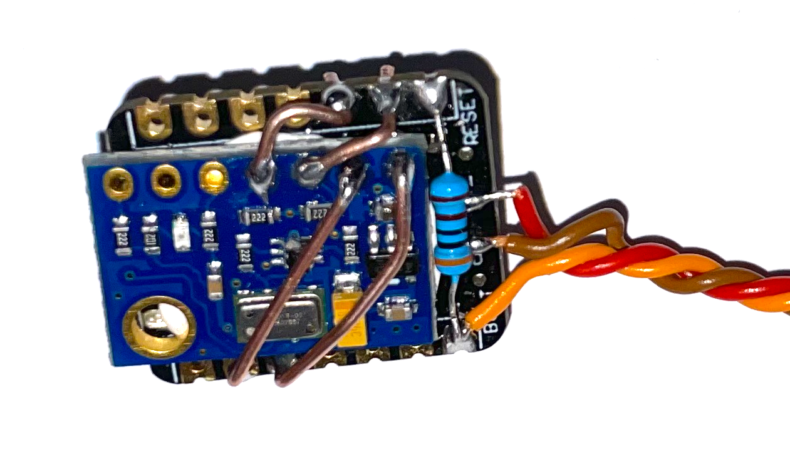
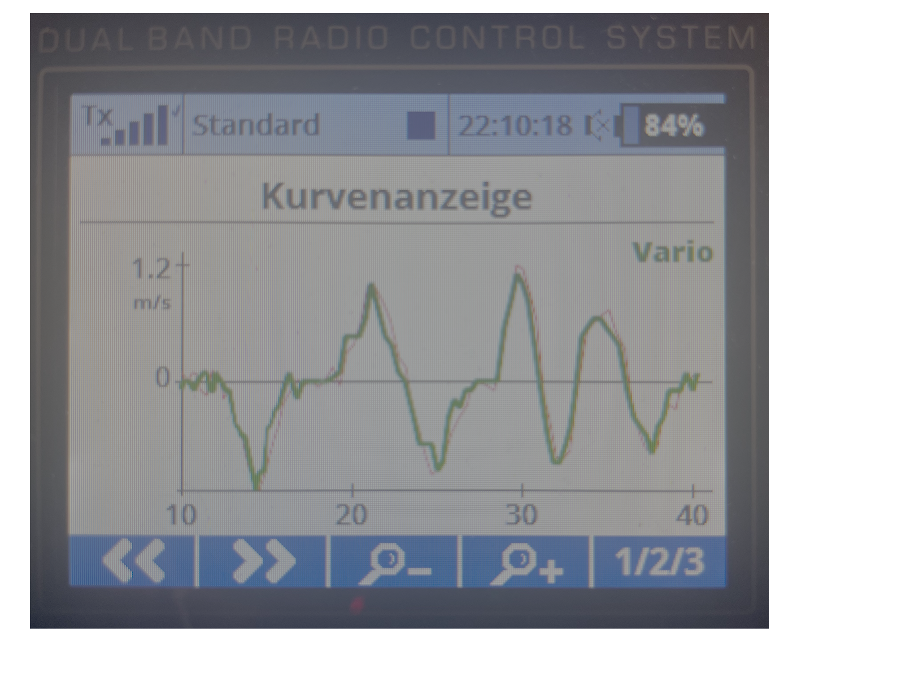

# JETI Ex Bus protocol (Python)
[](https://en.wikipedia.org/wiki/MIT_License)

## Introduction

A [JETI EX BUS protocol](http://www.jetimodel.com/en/Telemetry-Protocol/) implementation in Python or more specifically in [MicroPython](https://micropython.org/).
This allows to use microcontrollers (aka boards) like Raspbery Pi, ESP32 or similar to act as a sensor hub for [Jeti RC receivers](http://www.jetimodel.com/en/katalog/Duplex-2-4-EX/Receivers-EX/) and to transmit telemetry data from the board to the receiver and back to the transmitter (i.e. RC controls like this [DC24](http://www.jetimodel.com/en/katalog/Transmitters/@produkt/DC-24/)).

[Raspberry Pi  RP2040](https://www.raspberrypi.com/products/rp2040/) based platforms were used for development. The main application is to use the software on these boards together with one or more sensors attached to it. The main sensor interface is based on the [I2C protocol](https://en.wikipedia.org/wiki/I%C2%B2C). So all sensors using this interafce can be easiliy integrated, some are already predifined (see section features).


The code runs on two cores. One core handles the telemetry transfer, the other core prepares the telemetry based on data retrieved from sensors.


## Features

 - Pure Python (MicroPython) implementation of the Jeti Ex Bus protocol
 - Variometer functionality - currently following pressure sensors are supported:
   - [MS5611](https://www.amsys-sensor.com/products/pressure-sensor/ms5611-high-resolution-barometric-sensor-10-1200-mbar/)
   - [BME280](https://www.bosch-sensortec.com/products/environmental-sensors/humidity-sensors-bme280/)
 - Can be extended by any I2C capable sensor
 - Simple firmware/software update via USB-C
 - Easy logging of sensor data
 - Runs on boards which are supported by MicroPython (see [forum](https://forum.micropython.org/viewforum.php?f=10) or [code repository](https://github.com/micropython/micropython/tree/master/ports))
 - Two core implementation
   - Core-0 handles the transfer of JETI telemetry data via UART
   - Core-1 does the sensor reading via I2C and prepares the packets for the EX and EX-BUS protocols

> NOTE: Due to the implementation only boards with two cores are supported

## Boards

 Raspberry Pi RP2040 based boards are the main platform for this software. Other boards featuring two cores and running on MicroPython will be checked in the future.

 - [Raspberry Pi Pico series](https://www.raspberrypi.com/products/raspberry-pi-pico/)
 - [Pimoroni TINY 2040](https://shop.pimoroni.com/products/tiny-2040), small form factor (22.9 x 18.2 mm)
 - [Seeed Studio XIAO RP2040](https://www.seeedstudio.com/XIAO-RP2040-v1-0-p-5026.html), small form factor (21 x 17.5 mm)


## Dependencies

 - [MicroPython](https://micropython.org/)

## Installation

After finishing board and sensors (see further down) the MicroPython firmware needs to be installed. The firmware then is the operating system where MicroPython code can run. After this the software must be copied onto the board.

### Following steps describe the process:
1. Download the Micropython firmware for the specific board in use
   - As an example, the [XAIO RP2040](https://www.seeedstudio.com/XIAO-RP2040-v1-0-p-5026.html) runs the [Raspberry Pi Pico](https://micropython.org/download/rp2-pico/)  firmware
   - The firmware typically comes in the [USB flashing format (UF2)](https://github.com/Microsoft/uf2), for example [rp2-pico-20230426-v1.20.0.uf2](https://micropython.org/resources/firmware/rp2-pico-20230426-v1.20.0.uf2)
1. Press and hold the boot button (B) on the board, connect the USB-C cable and then release the button. This will put the board into the so called ***bootloader mode***. The board should now appear as USB drive on the computer
1. Copy (drag) the firmware onto this USB drive
1. Disconnect and re-connect the USB-C plug. The board is now ready to run MicroPython code
1. Use one of the following tools ([mpremote](https://docs.micropython.org/en/latest/reference/mpremote.html?highlight=mpremote), [Thonny](https://thonny.org/), [rshell](https://github.com/dhylands/rshell), [tio](https://github.com/tio/tio), etc.) to upload all files and folders to the board.
     The command line tool `mpremote` is the recommended way, as it allows to copy all files at once. The following command installs all files from this repository onto the board:
     ```
     mpremote mip install --target=/ github:chiefenne/JETI_EX_BUS
     ```
     To install a specific GitHub branch (e.g., develop) use:
     ```
     mpremote mip install --target=/ github:chiefenne/JETI_EX_BUS@develop
     ```

1. Unplug the USB-C cable and connect the board/sensor to the JETI receiver
1. Ready to go!

<br>

> NOTE: From the MicroPython docs: "The exact procedure for these steps is highly dependent on the particular board and you will need to refer to its documentation for details."

> NOTE: If there is already an older release of [JETI Ex Bus protocol (Python)](https://github.com/chiefenne/JETI_EX_BUS) installed, and an upddate to a newer version is performed, it is highly recommended to delete at first all files from the board. See below how to do that.

<br>

Wiping the board, is at the time of this writing, not easily possible with ```mpremote```. The filesystem can be formatted with the following fancy command for RP2040 boards (copied from [here](https://forum.micropython.org/viewtopic.php?t=12674)):

```
mpremote exec --no-follow "import os, machine, rp2; os.umount(/); bdev = rp2.Flash(); os.VfsLfs2.mkfs(bdev, progsize=256); vfs = os.VfsLfs2(bdev, progsize=256); os.mount(vfs, /); machine.reset()"
```

Sooner or later ```mpremote``` will have an option to achieve this in a simpler way. Check for this.

## Hardware Layer

 The flowchart (Fig. 1) describes the setup of the hardware and indicates the physical connections. The microcontroller is connected with the receiver via a serial asynchronous interface [UART](https://de.wikipedia.org/wiki/Universal_Asynchronous_Receiver_Transmitter). Physically the connection uses three wires (vcc, gnd, signal). Examples are shown in figures 9, 10 and 11.

 The Jeti telemetry runs via a half-duplex serial communication protocol. This means that there is a master (receiver) controlling the data flow and a slave (microcontroller/sensor) which is only allowed to answer upon request from the master. The master reserves a 4ms period for this to work. Measurments show approximately a 6ms period (see also figure 10).

 The connection between the board and the sensors is established via [I2C](https://de.wikipedia.org/wiki/I%C2%B2C). Four wires (vcc, gnd, sda, scl) are needed to connect each of the sensors.

<br>

<p align="center">
  <kbd> <!-- make a frame around the image -->
    
  </kbd>
</p>
<p align="center">
    <i>Fig. 1: Data flow and physical connections</i>
</p>

<br>

## Program Logic

The program logic consists of two parts. Those are the similar to the Arduino <b>*setup()*</b> and <b>*loop()*</b> functions.

  * In the beginning the communication channels (UART, I2C) are initialized. A serial connection (UART) is established between the microcontroller and the receiver. Additionally an I2C connection is setup between the microcontroller and the sensor(s).
  * After the setup of the communication, the two main (infinite) loops start, one infinite loop on each core.

<br>

<p align="center">
  <kbd> <!-- make a frame around the image -->
    
  </kbd>
</p>
<p align="center">
    <i>Fig. 2: Communication layer and multicore protocol handler</i>
</p>

<br>

## Connecting board and sensor

Below example shows how a [BME280](https://www.bosch-sensortec.com/products/environmental-sensors/humidity-sensors-bme280/) pressure sensor is soldered to a XIAO RP2040 board. In a similar way the VCC and GND connections between both boards are soldered as well (see figures 4, 5, 7).

<p align="center">
  <kbd> <!-- make a frame around the image -->
    
  </kbd>
</p>
<p align="center">
    <i>Fig. 3: BME280 sensor at first connected to SDA, SCL. The sensor is then flipped down.</i>
</p>

<br>

The following images show the components and connections for a XIAO RP2040 board. For other boards the respective UART pins (TX, RX) have to be selected according the board specific pinout. After the pressure sensor is flipped down, the power and ground (GND) connections can be established. Double-sided adhesive tape or hot glue fix the board and the sensor to each other.

The voltage requirements of the sensor have to be checked, the used [BME280](https://www.bosch-sensortec.com/products/environmental-sensors/humidity-sensors-bme280/) sensor runs on 3.3V. The respective 3.3V pin on the microcontroller has then to be connected to VCC on the sensor.

The servo cable (red, brown, orange) is soldered according to the image below. The servo signal cable (orange) goes to RX (pin D7). The VIN pin (5V) is used for the power connection between receiver and board. If the board is connected to a USB-C cable then this pin outputs approximately 5V and powers the receiver if it is attached. If used in the RC plane then the power comes from the receiver to the board (of course no USB cable is attached then).


A resistor (2.4 k&Omega; up to a few k&Omega;s) needs to be soldered between the TX and RX pins. On the XIAO RP2040 these are pins D6 and D7 respectively. The resitor enables the half-duplex communication which is triggered by the JETI receiver.
<br>

<!-- HTML syntax for image display allows to change the image size -->

<br>

<p align="center">
  <kbd> <!-- make a frame around the image -->
    
  </kbd>
</p>
<p align="center">
    <i>Fig. 4: Setup with a BME280 sensor. 3.3V (red) and GND (black) from board to sensor</i>
</p>

<br>

<p align="center">
  <kbd> <!-- make a frame around the image -->
    
  </kbd>
</p>
<p align="center">
    <i>Fig. 5: Data (SDA, yellow) and clock (SCL, green) connections for I2C bus</i>
</p>

<br>

Figure 6 shows a USB-C plug connected to the microcontroller. The connection from the microcontroller to the JETI receiver needs to be on a socket (here 6), which is set to run the EX BUS protocol (see figure 8).

<br>

<p align="center">
  <kbd> <!-- make a frame around the image -->
    
  </kbd>
</p>
<p align="center">
    <i>Fig. 6: Setup for software update and development</i>
</p>

<br>

<p align="center">
  <kbd> <!-- make a frame around the image -->
    
  </kbd>
</p>
<p align="center">
    <i>Fig. 7: Here an MS5611 sensor is attached</i>
</p>

a<br>

<p align="center">
  <kbd> <!-- make a frame around the image -->
    
  </kbd>
</p>
<p align="center">
    <i>Fig. 7a: Compare climb rate (green) with  to Jeti MVario2 (red)</i>
</p>

<br>

### Channel setup in the device manager of the transmitter

Below figure depicts the JETI display for the receiver settings (German language).

<br>

<p align="center">
  <kbd> <!-- make a frame around the image -->
    
  </kbd>
</p>
<p align="center">
    <i>Fig. 8: The receiver channel where the microcontroller is connected needs the <b>EX Bus</b> setting activated</i>
</p>

<br>

## Data from logic level analyzer

The data recorded are coming from the master (receiver) and show a duration of approximately **3.8ms** for the channel data and the concatenated telemetry request (see figure below). Click on the image to see a larger version.

<br>

<p align="center">
  <kbd> <!-- make a frame around the image -->
    
  </kbd>
</p>
<p align="center">
    <i>Fig. 9: Jeti EX BUS protocol. Example shows channel data (i.e., transmitter controls) and then a telemtry request</i>
</p>

<br>

The time between two channel/telemetry request packages is approximately **6.2ms**. The EX bus protocol documentation states that a period of **4ms** after the telemetry/JetiBox request is reserved for the answer from the sensor, etc. Click on the image to see a larger version.

<p align="center">
<kbd> <!-- make a frame around the image -->

</kbd>
</p>
<p align="center">
    <i>Fig. 10: Jeti EX BUS protocol. Example shows the waiting period allowed for answering with telemetry</i>
</p>

<br>

The image below shows a detailed view of the beginning of a packet (digital and analog). Click on the image to see a larger version.

<br>

<p align="center">
  <kbd> <!-- make a frame around the image -->
    
  </kbd>
</p>
</p>
<p align="center">
    <i>Fig. 11: Jeti EX BUS protocol. Zoomed view (digital/analog data from the logic level analyzer).</i>
</p>

<br>

The next figure depicts a telemetry answer from the microcontroller/sensor (slave). In this case it is an answer from a Jeti MVario 2 sensor. The telemetry data were sent in aprox. **2.7ms**. In order to answer a telemetry request, there are **4ms** reserved on the EX bus, so this packet fits well into that. Click on the image to see a larger version.

<br>

<p align="center">
  <kbd> <!-- make a frame around the image -->
    
  </kbd>
</p>
<p align="center">
    <i>Fig. 12: Jeti EX BUS protocol. Example of Jeti MVario 2 telemetry answer.</i>
</p>

<br>

## Sample EX Bus data stream
Written by the function [Streamrecorder.py](https://github.com/chiefenne/JETI_EX_BUS/blob/main/src/Utils/Streamrecorder.py) which should only be activated to record the serial stream. This is only meaningful for debugging purposes.

The receiver is the master and triggers the half-duplex communication. As an example **3e:03** is the beginning of a packet containing channel data sent by the receiver (the packet describes the current actuator settings of the transmitter). A telemetry request (from receiver/master to the microcontroller/sensor) is indicated by **3d:01** which is the start of an 8 byte packet. After this there is a 4ms window to send telemetry data back from the board to the receiver (not visible in this data stream).

```Text
02:02:7d:dd:2e:e7:2e:f2:2e:e0:2e:e0:2e:e0:2e:e0:2e:e0:2e:e0:2e:e0:2e:e0:2e:e0:2e:e0:2e:e0:2e:e0:2e:78:69:3e:03:28:42:31:20:40:1f:dd:2e:e7:2e:f2:2e:e0
2e:e0:2e:e0:2e:e0:2e:e0:2e:e0:2e:e0:2e:e0:2e:e0:2e:e0:2e:e0:2e:e0:2e:e0:2e:78:69:3d:01:08:42:3a:00:8f:e4:3e:03:28:42:31:20:40:1f:dd:2e:e7:2e:f2:2e:e0
2e:e0:2e:e0:2e:e0:2e:e0:2e:e0:2e:e0:2e:e0:2e:3e:03:28:42:31:20:40:1f:dd:2e:e7:2e:f2:2e:e0:2e:e0:2e:e0:2e:e0:2e:e0:2e:e0:2e:e0:2e:e0:2e:e0:2e:e0:2e:e0
2e:e0:2e:78:69:3d:01:08:42:3a:00:8f:e4:3e:03:28:42:31:20:40:1f:dd:2e:e7:2e:f2:2e:e0:2e:e0:2e:e0:2e:e0:2e:e0:2e:e0:2e:e0:2e:e0:2e:e0:2e:e0:2e:e0:2e:e0
2e:78:69:3d:01:08:42:3a:00:8f:e4:3e:03:28:42:31:20:40:1f:dd:2e:e7:2e:f2:2e:e0:2e:e0:2e:e0:2e:e0:2e:e0:2e:e0:2e:e0:2e:e0:2e:e0:2e:e0:2e:e0:2e:e0:2e:78
69:3d:01:08:42:3a:00:8f:e4:3e:03:28:42:31:20:40:1f:dc:2e:e7:2e:f2:2e:e0:2e:e0:2e:e0:2e:e0:2e:e0:2e:e0:2e:e0:2e:e0:2e:e0:2e:e0:2e:e0:2e:e0:2e:8b:49:3d
```

See [EX_Bus_stream.txt](https://github.com/chiefenne/JETI_EX_BUS/blob/main/docs/EX_Bus_stream.txt) for a 1 second recording of the bus (this feature can be activated in the code for debugging purposes).

## Credits

Apart from the JETI telemetry documentation, the code of this repo has learned from many sources.


Following sources were most helpful (without those I couldn't have done this at all):
- [MicroPython docs](https://docs.micropython.org/en/v1.20.0/)
- [MicroPython forum](https://github.com/orgs/micropython/discussions)
- [Sepp62](https://github.com/Sepp62/JetiExBus)
- [nichtgedacht](https://github.com/nichtgedacht/JetiExBus)
- [nightflyer88](https://github.com/nightflyer88/Jeti_VarioGPS-Sensor)
- [Pulsar07](https://github.com/Pulsar07/Jeti_VarioGPS-Sensor)
- [Betaflight Jeti telemetry](https://github.com/betaflight/betaflight/blob/master/src/main/telemetry/jetiexbus.c)
- [RC-Thoughts](https://github.com/RC-Thoughts)

## License

Distributed under the MIT license. See [LICENSE](https://raw.githubusercontent.com/chiefenne/PyAero/master/LICENSE) for more information.

<br><br>
2023 Andreas Ennemoser – andreas.ennemoser@aon.at
