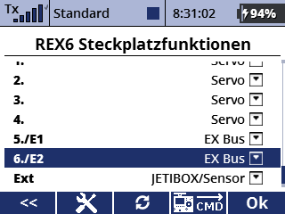
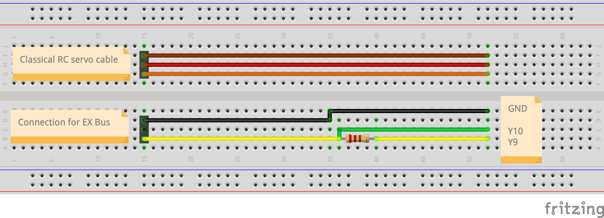

# JETI Ex Bus protocol (Python)
[](https://en.wikipedia.org/wiki/MIT_License)


A [JETI](http://www.jetimodel.com/en/) [Ex Bus protocol](http://www.jetimodel.com/en/Telemetry-Protocol/) implementation in Python or more specifically in [MicroPython](https://micropython.org/).
This will allow to use boards like RaspberyPi, ESP3286 or similar to act as a sensor hub for [Jeti RC receivers](http://www.jetimodel.com/en/katalog/Duplex-2-4-EX/Receivers-EX/) and to transmit telemetry data from the board to the receiver and thus back to the transmitter (i.e. RC controls like this [DC24](http://www.jetimodel.com/en/katalog/Transmitters/@produkt/DC-24/)).


> NOTE: This is currently rather a proof of concept and NOT ready for use.
> I use this mainly to learn about serial communication between microcontrollers and/or RC devices.

> NOTE: My first tests will be done in a classical linear programming way (no asynchronous operations).
> I'll check how far I can come with this somewhat simpler approach.

> NOTE: Possibly I will be studying uasyncio which seems to be the proper way of implementing the Ex Bus protocol.
> For reference see [this example](https://github.com/peterhinch/micropython-async/blob/master/v3/as_demos/auart_hd.py).


## Features (planned)

 - Pure Python (MicroPython) impementation of the Jeti Ex Bus protocol
 - Runs on boards which are supported by MicroPython (see [forum](https://forum.micropython.org/viewforum.php?f=10) or [code repository](https://github.com/micropython/micropython/tree/master/ports))
 - Simple firmware update via USB
 - Easy logging of sensor data on the board (SD card, etc.)

## Boards

 - [Pyboard](https://store.micropython.org/product/PYBv1.1) 
   - This board is used for the development
   - STM32F405RG microcontroller
   - 168 MHz Cortex-M4 CPU
 - Planned: [TINY2040](https://shop.pimoroni.com/products/tiny-2040) (22.9 x 18.2)
 - Planned: [ESP8266](https://en.wikipedia.org/wiki/ESP8266), [ESP32](https://en.wikipedia.org/wiki/ESP32)
 - Would be cool: [TEENSY 4.0](https://www.pjrc.com/store/teensy40.html)
   - Not yet ported to MicroPython (CircuitPython port exists)
   - 2Mb flash, 600 MHz Cortex-M7 and decent size (29.2 x 17.8mm)

## Dependencies

 - [MicroPython](https://micropython.org/)

## Sample EX Bus data stream (from receiver)

The receiver is the master and triggers the half-duplex communication. As an example **3e:03** is the beginning of a packet containing channel data sent by the receiver (the packet describes the current actuator settings of the transmitter). A telemetry request (from receiver/master to the Pyboard/sensor) is indicated by **3d:01** which is the start of an 8 byte packet. After this there is a 4ms window to send telemetry data back from the board to the receiver (not visible in this data stream).

``` Text
02:02:7d:dd:2e:e7:2e:f2:2e:e0:2e:e0:2e:e0:2e:e0:2e:e0:2e:e0:2e:e0:2e:e0:2e:e0:2e:e0:2e:e0:2e:e0:2e:78:69:3e:03:28:42:31:20:40:1f:dd:2e:e7:2e:f2:2e:e0
2e:e0:2e:e0:2e:e0:2e:e0:2e:e0:2e:e0:2e:e0:2e:e0:2e:e0:2e:e0:2e:e0:2e:e0:2e:78:69:3d:01:08:42:3a:00:8f:e4:3e:03:28:42:31:20:40:1f:dd:2e:e7:2e:f2:2e:e0
2e:e0:2e:e0:2e:e0:2e:e0:2e:e0:2e:e0:2e:e0:2e:3e:03:28:42:31:20:40:1f:dd:2e:e7:2e:f2:2e:e0:2e:e0:2e:e0:2e:e0:2e:e0:2e:e0:2e:e0:2e:e0:2e:e0:2e:e0:2e:e0
2e:e0:2e:78:69:3d:01:08:42:3a:00:8f:e4:3e:03:28:42:31:20:40:1f:dd:2e:e7:2e:f2:2e:e0:2e:e0:2e:e0:2e:e0:2e:e0:2e:e0:2e:e0:2e:e0:2e:e0:2e:e0:2e:e0:2e:e0
2e:78:69:3d:01:08:42:3a:00:8f:e4:3e:03:28:42:31:20:40:1f:dd:2e:e7:2e:f2:2e:e0:2e:e0:2e:e0:2e:e0:2e:e0:2e:e0:2e:e0:2e:e0:2e:e0:2e:e0:2e:e0:2e:e0:2e:78
69:3d:01:08:42:3a:00:8f:e4:3e:03:28:42:31:20:40:1f:dc:2e:e7:2e:f2:2e:e0:2e:e0:2e:e0:2e:e0:2e:e0:2e:e0:2e:e0:2e:e0:2e:e0:2e:e0:2e:e0:2e:e0:2e:8b:49:3d
```

See [EX_Bus_stream.txt](https://github.com/chiefenne/JETI_EX_BUS/blob/main/docs/EX_Bus_stream.txt) for a 1 second recording of the bus (this feature can be activated in the code for debugging purposes).

## Connecting Pyboard and receiver

### Setup used during develompent and testing

The following image shows the components and connections as used during the development.

<!-- HTML syntax for image display allows to change the image size -->
<kbd> <!-- make a frame around the image -->

</kbd>

The Pyboard is in a small housing and a Jeti REX6 receiver is attached. The yellow wire (channel 6) splits into two wires (one with a 2.4kOhm resistor as per the Jeti specification) which are connected to TX(Y9) and RX(Y10) on UART(3) on the Pyboard. The black wire establishes a common ground. The receiver is powered by a 4S NiMH accumulator via channel 1. Channel 6 of the receiver was set to "Ex Bus" (see image below) in the device manager of the Jeti transmitter.

### Channel setup in the device manager of the transmitter

<kbd> <!-- make a frame around the image -->

</kbd>

### EX Bus connection cable

<kbd> <!-- make a frame around the image -->

</kbd>

Connection cable for the EX Bus. A standard RC servo cable has 3 wires (signal, vcc, gnd). When connecting to an EX Bus channel on the receiver, one needs one wire (yellow here) which splits into two wires (yellow, green). One of them gets a resistor (2.4k&Omega;) soldered in line (this one goes into GPIO Y9 (TX); see [Pyboard pinout](https://micropython.org/resources/pybv11-pinout.jpg)). The figure describes the setup for the referenced Pyboard setup. The yellow wire is the one that needs to be connected to the signal pin on the receiver. The black wire (as described above) establishes a common ground between receiver and Pyboard. Since the Pyboard is powered via USB here, we do not need to connect the vcc (red plus wire). This is obviously only meaningful, while in a development phase on the computer. In normal operation, the Pyboard (or any othe board running MicroPython), when acting as a sensor or sensor hub, would need a proper voltage supply (which can come from the receiver).

<br><br><br>
Andreas Ennemoser – andreas.ennemoser@aon.at

Distributed under the MIT license. See [LICENSE](https://raw.githubusercontent.com/chiefenne/PyAero/master/LICENSE) for more information.
