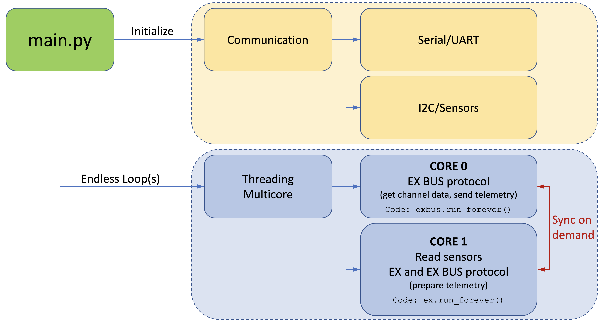

# JETI Ex Bus protocol (Python)
[](https://en.wikipedia.org/wiki/MIT_License)


<!--
Trick for text coloring as its not implemented yet in Github flavored markdown
```diff
- text in red
+ text in green
! text in orange
# text in gray
@@ text in purple (and bold)@@
```
-->
```diff
- WORK IN PROGRESS, NOT YET READY FOR USE.
+ THE CORE PART OF THE BUS STRUCTURE EXISTS (still with errors)
+ Channel information can already be read correctly
- Telemetry still missing
```


A [JETI](http://www.jetimodel.com/en/) [Ex Bus protocol](http://www.jetimodel.com/en/Telemetry-Protocol/) implementation in Python or more specifically in [MicroPython](https://micropython.org/).
This will allow to use boards like Raspbery Pi, ESP32 or similar to act as a sensor hub for [Jeti RC receivers](http://www.jetimodel.com/en/katalog/Duplex-2-4-EX/Receivers-EX/) and to transmit telemetry data from the board to the receiver and thus back to the transmitter (i.e. RC controls like this [DC24](http://www.jetimodel.com/en/katalog/Transmitters/@produkt/DC-24/)).

> NOTE: The current implementation relies on threading using two cores. The development platform thus has changed from the [Pyboard](https://store.micropython.org/product/PYBv1.1) to the [Pimoroni Tiny 2040](https://shop.pimoroni.com/products/tiny-2040) which uses the Raspberry Pi [RP2040](https://www.raspberrypi.com/products/rp2040/) processor.


## Features

 - Pure Python (MicroPython) impementation of the Jeti Ex Bus protocol
 - Runs on boards which are supported by MicroPython (see [forum](https://forum.micropython.org/viewforum.php?f=10) or [code repository](https://github.com/micropython/micropython/tree/master/ports))
 - Simple firmware/software update via USB
 - Easy logging of sensor data on the board

## Boards

 - [TINY 2040](https://shop.pimoroni.com/products/tiny-2040) (22.9 x 18.2)
   - 133 MHz Cortex-M0+
   - 8MB QSPI flash
 - Planned: [ESP32](https://en.wikipedia.org/wiki/ESP32)
   - 160 MHz - 240 MHz
   - up to 16 Mb flash memory
   - Wi-Fi (use the phone as a JetiBox ???)

## Dependencies

 - [MicroPython](https://micropython.org/)

## Hardware Layer

 The flowchart (Fig. 1) describes the setup of the hardware and indicates the physical connections. The microcontroller is connected with the receiver via a serial asynchronous interface [UART](https://de.wikipedia.org/wiki/Universal_Asynchronous_Receiver_Transmitter). Physically the connection uses three wires (vcc, gnd, signal). Examples are shown in Fig. 7, Fig. 8, Fig. 9 and Fig. 11.

 The Jeti telemetry runs via a half-duplex serial communication protocol. This means that there is a master (receiver) controlling the data flow and a slave (microcontroller/sensor) which is only allowed to answer upon request from the master. The master reserves a 4ms period for this to work. Measurments show approximately a 6ms period (see Fig. 4).

 The connection between the board and the sensors is established via [I2C](https://de.wikipedia.org/wiki/I%C2%B2C). Four wires are (vcc, gnd, sda, scl) needed to connect each of the sensors.
 
> NOTE: During testing the microcontroller is supplied via USB power (thus no vcc connection between board and receiver) and the Jeti receiver is supplied via NiMh batteries. They share a common ground. In the real application the microcontroller will also be powered via the the battery (through the receiver).

</br>

<p align="center">
  <kbd> <!-- make a frame around the image -->
    
  </kbd>
</p>
<p align="center">
    <i>Fig. 1: Data flow and physical connections</i>
</p>

</br>

## Program Logic

The program logic consists of two parts. Those are the similar to the Arduino <b>*setup()*</b> and <b>*loop()*</b> functions.

  * In the beginning the communication channels (UART, I2C) are initialized. A serial connection (UART) is established between the microcontroller and the receiver. Additionally an I2C connection is setup between the microcontroller and the sensor(s).
  * After the setup of the communication, the main (infinite) loop starts. 

</br>

<p align="center">
  <kbd> <!-- make a frame around the image -->
    
  </kbd>
</p>
<p align="center">
    <i>Fig. 2: Communication layer and multicore protocol handler</i>
</p>

</br>

## Sample EX Bus data stream
Written by function [Streamrecorder.py](https://github.com/chiefenne/JETI_EX_BUS/blob/main/src/Utils/Streamrecorder.py).

The receiver is the master and triggers the half-duplex communication. As an example **3e:03** is the beginning of a packet containing channel data sent by the receiver (the packet describes the current actuator settings of the transmitter). A telemetry request (from receiver/master to the Pyboard/sensor) is indicated by **3d:01** which is the start of an 8 byte packet. After this there is a 4ms window to send telemetry data back from the board to the receiver (not visible in this data stream).

```Text
02:02:7d:dd:2e:e7:2e:f2:2e:e0:2e:e0:2e:e0:2e:e0:2e:e0:2e:e0:2e:e0:2e:e0:2e:e0:2e:e0:2e:e0:2e:e0:2e:78:69:3e:03:28:42:31:20:40:1f:dd:2e:e7:2e:f2:2e:e0
2e:e0:2e:e0:2e:e0:2e:e0:2e:e0:2e:e0:2e:e0:2e:e0:2e:e0:2e:e0:2e:e0:2e:e0:2e:78:69:3d:01:08:42:3a:00:8f:e4:3e:03:28:42:31:20:40:1f:dd:2e:e7:2e:f2:2e:e0
2e:e0:2e:e0:2e:e0:2e:e0:2e:e0:2e:e0:2e:e0:2e:3e:03:28:42:31:20:40:1f:dd:2e:e7:2e:f2:2e:e0:2e:e0:2e:e0:2e:e0:2e:e0:2e:e0:2e:e0:2e:e0:2e:e0:2e:e0:2e:e0
2e:e0:2e:78:69:3d:01:08:42:3a:00:8f:e4:3e:03:28:42:31:20:40:1f:dd:2e:e7:2e:f2:2e:e0:2e:e0:2e:e0:2e:e0:2e:e0:2e:e0:2e:e0:2e:e0:2e:e0:2e:e0:2e:e0:2e:e0
2e:78:69:3d:01:08:42:3a:00:8f:e4:3e:03:28:42:31:20:40:1f:dd:2e:e7:2e:f2:2e:e0:2e:e0:2e:e0:2e:e0:2e:e0:2e:e0:2e:e0:2e:e0:2e:e0:2e:e0:2e:e0:2e:e0:2e:78
69:3d:01:08:42:3a:00:8f:e4:3e:03:28:42:31:20:40:1f:dc:2e:e7:2e:f2:2e:e0:2e:e0:2e:e0:2e:e0:2e:e0:2e:e0:2e:e0:2e:e0:2e:e0:2e:e0:2e:e0:2e:e0:2e:8b:49:3d
```

See [EX_Bus_stream.txt](https://github.com/chiefenne/JETI_EX_BUS/blob/main/docs/EX_Bus_stream.txt) for a 1 second recording of the bus (this feature can be activated in the code for debugging purposes).

## Data from logic level analyzer

The data recorded are coming from the master (receiver) and show a duration of approximately **3.8ms** for the channel data and the concatenated telemetry request (see figure below). Click on the image to see a larger version.

<br>

<p align="center">
  <kbd> <!-- make a frame around the image -->
    
  </kbd>
</p>
<p align="center">
    <i>Fig. 3: Jeti EX BUS protocol. Example shows channel data (i.e., transmitter controls) and then a telemtry request</i>
</p>

<br>

The time between two channel/telemetry request packages is approximately **6.2ms**. The EX bus protocol documentation states that a period of **4ms** after the telemetry/JetiBox request is reserved for the answer from the sensor, etc. Click on the image to see a larger version.

<p align="center">
<kbd> <!-- make a frame around the image -->

</kbd>
</p>
<p align="center">
    <i>Fig. 4: Jeti EX BUS protocol. Example shows the waiting period allowed for answering with telemetry</i>
</p>

<br>

The image below shows a detailed view of the beginning of a packet (digital and analog). Click on the image to see a larger version.

<br>

<p align="center">
  <kbd> <!-- make a frame around the image -->
    
  </kbd>
</p>
</p>
<p align="center">
    <i>Fig. 5: Jeti EX BUS protocol. Zoomed view (digital/analog data from the logic level analyzer).</i>
</p>

<br>

The next figure depicts a telemetry answer from the microcontroller/sensor (slave). In this case it is an answer from a Jeti MVario 2 sensor. The telemetry data were sent in aprox. **2.7ms**. In order to answer a telemetry request, there are **4ms** reserved on the EX bus, so this packet fits well into that. Click on the image to see a larger version.

<br>

<p align="center">
  <kbd> <!-- make a frame around the image -->
    
  </kbd>
</p>
<p align="center">
    <i>Fig. 6: Jeti EX BUS protocol. Example of Jeti MVario 2 telemetry answer.</i>
</p>

<br>

## Connecting TINY 2040 and receiver

### Setup used during develompent and testing

The following image shows the components and connections as used during the development.

<!-- HTML syntax for image display allows to change the image size -->

<br>

<p align="center">
  <kbd> <!-- make a frame around the image -->
    
  </kbd>
</p>
<p align="center">
    <i>Fig. 7: Development setup. Note: no vcc from receiver to microcontroller.</i>
</p>

<br>

<p align="center">
  <kbd> <!-- make a frame around the image -->
    
  </kbd>
</p>
<p align="center">
    <i>Fig. 8: Development setup. Closeup view.</i>
</p>

<br>

The figure below shows how the signal cable coming from the receiver is "split" to create the half-duplex communication. The resistor is soldered only on one of the split wires. The wire with the resistor needs to be connected with the <b>TX</b> pin of the board. The other wire connects to the <b>RX</b> pin respectively.

<br>

<p align="center">
  <kbd> <!-- make a frame around the image -->
    
  </kbd>
</p>
<p align="center">
    <i>Fig. 9: Development setup (here on the Pyboard). Closeup view on the cable split and resistor.</i>
</p>

<br>

The Pyboard is in a small housing and a Jeti REX6 receiver is attached. The yellow wire (channel 6) splits into two wires (one with a 2.4kOhm resistor as per the Jeti specification) which are connected to TX(Y9) and RX(Y10) on UART(3) on the Pyboard. The black wire establishes a common ground. The receiver is powered by a 4S NiMH accumulator via channel 1. Channel 6 of the receiver was set to "Ex Bus" (see image below) in the device manager of the Jeti transmitter.

### Channel setup in the device manager of the transmitter

<br>

<p align="center">
  <kbd> <!-- make a frame around the image -->
    
  </kbd>
</p>
<p align="center">
    <i>Fig. 10: The receiver channel where the microcontroller is connected needs the <b>EX Bus</b> setting.</i>
</p>

<br>

### EX Bus connection cable

<br>

<p align="center">
  <kbd> <!-- make a frame around the image -->
    
  </kbd>
</p>
<p align="center">
    <i>Fig. 11: Comparison of standard servo cable vs. EX bus cable attached to a RP2040 Zero.</i>
</p>

<br>

Connection cable for the EX Bus. A standard RC servo cable has 3 wires (signal, vcc, gnd). When connecting to an EX Bus channel on the receiver, one needs one wire (yellow here) which splits into two wires (yellow, green). The yellow cable gets a resistor (2.4k&Omega;) soldered in line which needs to be connected to <b>*TX*</b> on the microcontroller. The green cable splits off the yellow cable before the transistor and needs to be connected to <b>*RX*</b> on the microcontroller.

 The yellow wire is the one that needs to be connected to the signal pin on the receiver. The black wire (as described above) establishes a common ground between receiver and the microcontroller. Since the board is powered via USB here, we do not need to connect the vcc (red plus wire). This is obviously only meaningful, while in a development phase on the computer. In normal operation, the board running MicroPython would need a voltage supply (normally it comes from the receiver then).

<br><br>
2023 Andreas Ennemoser – andreas.ennemoser@aon.at

Distributed under the MIT license. See [LICENSE](https://raw.githubusercontent.com/chiefenne/PyAero/master/LICENSE) for more information.
