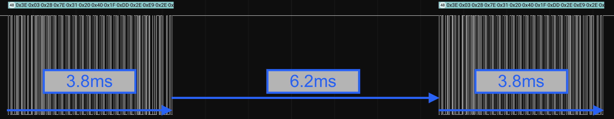

# JETI Ex Bus protocol (Python)
[](https://en.wikipedia.org/wiki/MIT_License)


<!--
Trick for text coloring as its not implemented yet in Github flavored markdown
```diff
- text in red
+ text in green
! text in orange
# text in gray
@@ text in purple (and bold)@@
```
-->
```diff
- WORK IN PROGRESS, NOT YET READY FOR USE.
+ THE CORE PART OF THE BUS STRUCTURE EXISTS (still with errors)
+ Channel information can already be read correctly
- Telemetry still missing
```


A [JETI](http://www.jetimodel.com/en/) [Ex Bus protocol](http://www.jetimodel.com/en/Telemetry-Protocol/) implementation in Python or more specifically in [MicroPython](https://micropython.org/).
This will allow to use boards like Raspbery Pi, ESP32 or similar to act as a sensor hub for [Jeti RC receivers](http://www.jetimodel.com/en/katalog/Duplex-2-4-EX/Receivers-EX/) and to transmit telemetry data from the board to the receiver and thus back to the transmitter (i.e. RC controls like this [DC24](http://www.jetimodel.com/en/katalog/Transmitters/@produkt/DC-24/)).

> NOTE: The current implementation relies on threading using two cores. The development platform thus has changed from the [Pyboard](https://store.micropython.org/product/PYBv1.1) to the [Pimoroni Tiny 2040](https://shop.pimoroni.com/products/tiny-2040) which uses the Raspberry Pi [RP2040](https://www.raspberrypi.com/products/rp2040/) processor.


## Features

 - Pure Python (MicroPython) impementation of the Jeti Ex Bus protocol
 - Runs on boards which are supported by MicroPython (see [forum](https://forum.micropython.org/viewforum.php?f=10) or [code repository](https://github.com/micropython/micropython/tree/master/ports))
 - Simple firmware/software update via USB
 - Easy logging of sensor data on the board

## Boards

 - [TINY 2040](https://shop.pimoroni.com/products/tiny-2040) (22.9 x 18.2)
   - 133 MHz Cortex-M0+
   - 8MB QSPI flash
 - Planned: [ESP32](https://en.wikipedia.org/wiki/ESP32)
   - 160 MHz - 240 MHz
   - up to 16 Mb flash memory
   - Wi-Fi (use the phone as a JetiBox ???)

## Dependencies

 - [MicroPython](https://micropython.org/)

## Hardware Layer

 The following flowchart describes the setup of the hardware and indicates the physical connections. The receiver is connected with the board (RP2040 board, ESP32, etc.) via three wires (vcc, gnd, signal). The connection between the board and the sensors is established via four wires (vcc, gnd, sda, scl) for each of the sensors (I2C). 

<p align="center">
  <kbd> <!-- make a frame around the image -->
    
  </kbd>
</p>

## Program Logic

<p align="center">
  <kbd> <!-- make a frame around the image -->
    
  </kbd>
</p>

## Sample EX Bus data stream
Written by function [Streamrecorder.py](https://github.com/chiefenne/JETI_EX_BUS/blob/main/src/Utils/Streamrecorder.py).

The receiver is the master and triggers the half-duplex communication. As an example **3e:03** is the beginning of a packet containing channel data sent by the receiver (the packet describes the current actuator settings of the transmitter). A telemetry request (from receiver/master to the Pyboard/sensor) is indicated by **3d:01** which is the start of an 8 byte packet. After this there is a 4ms window to send telemetry data back from the board to the receiver (not visible in this data stream).

```Text
02:02:7d:dd:2e:e7:2e:f2:2e:e0:2e:e0:2e:e0:2e:e0:2e:e0:2e:e0:2e:e0:2e:e0:2e:e0:2e:e0:2e:e0:2e:e0:2e:78:69:3e:03:28:42:31:20:40:1f:dd:2e:e7:2e:f2:2e:e0
2e:e0:2e:e0:2e:e0:2e:e0:2e:e0:2e:e0:2e:e0:2e:e0:2e:e0:2e:e0:2e:e0:2e:e0:2e:78:69:3d:01:08:42:3a:00:8f:e4:3e:03:28:42:31:20:40:1f:dd:2e:e7:2e:f2:2e:e0
2e:e0:2e:e0:2e:e0:2e:e0:2e:e0:2e:e0:2e:e0:2e:3e:03:28:42:31:20:40:1f:dd:2e:e7:2e:f2:2e:e0:2e:e0:2e:e0:2e:e0:2e:e0:2e:e0:2e:e0:2e:e0:2e:e0:2e:e0:2e:e0
2e:e0:2e:78:69:3d:01:08:42:3a:00:8f:e4:3e:03:28:42:31:20:40:1f:dd:2e:e7:2e:f2:2e:e0:2e:e0:2e:e0:2e:e0:2e:e0:2e:e0:2e:e0:2e:e0:2e:e0:2e:e0:2e:e0:2e:e0
2e:78:69:3d:01:08:42:3a:00:8f:e4:3e:03:28:42:31:20:40:1f:dd:2e:e7:2e:f2:2e:e0:2e:e0:2e:e0:2e:e0:2e:e0:2e:e0:2e:e0:2e:e0:2e:e0:2e:e0:2e:e0:2e:e0:2e:78
69:3d:01:08:42:3a:00:8f:e4:3e:03:28:42:31:20:40:1f:dc:2e:e7:2e:f2:2e:e0:2e:e0:2e:e0:2e:e0:2e:e0:2e:e0:2e:e0:2e:e0:2e:e0:2e:e0:2e:e0:2e:e0:2e:8b:49:3d
```

See [EX_Bus_stream.txt](https://github.com/chiefenne/JETI_EX_BUS/blob/main/docs/EX_Bus_stream.txt) for a 1 second recording of the bus (this feature can be activated in the code for debugging purposes).

## Data from logic level analyzer

The data recorded are coming from the master (receiver) and show a duration of approximately **3.8ms** for the channel data and the concatenated telemetry request (see figure below). Click on the image to see a larger version.

<kbd> <!-- make a frame around the image -->

</kbd>

The time between two channel/telemetry request packages is approximately **6.2ms**. The EX bus protocol documentation states that a period of **4ms** after the telemetry/JetiBox request is reserved for the answer from the sensor, etc. Click on the image to see a larger version.

<kbd> <!-- make a frame around the image -->

</kbd>

The image below shows a detailed view of the beginning of a packet (digital and analog). Click on the image to see a larger version.

<kbd> <!-- make a frame around the image -->

</kbd>

The next figure depicts a telemetry answer from the sensor (slave). In this case it is an answer from a Jeti MVario 2 sensor. The telemetry data were sent in aprox. **2.7ms**. In order to answer a telemetry request, there are **4ms** reserved on the EX bus, so this packet fits well into that. Click on the image to see a larger version.

<kbd> <!-- make a frame around the image -->

</kbd>

## Connecting TINY 2040 and receiver

### Setup used during develompent and testing

The following image shows the components and connections as used during the development.

<!-- HTML syntax for image display allows to change the image size -->
<kbd> <!-- make a frame around the image -->

</kbd>
<kbd> <!-- make a frame around the image -->

</kbd>

The figure below shows how the resistor is soldered at the split point of the wires. It is only active on the wire going to the **Y9** pin of the Pyboard.

<kbd> <!-- make a frame around the image -->

</kbd>

The Pyboard is in a small housing and a Jeti REX6 receiver is attached. The yellow wire (channel 6) splits into two wires (one with a 2.4kOhm resistor as per the Jeti specification) which are connected to TX(Y9) and RX(Y10) on UART(3) on the Pyboard. The black wire establishes a common ground. The receiver is powered by a 4S NiMH accumulator via channel 1. Channel 6 of the receiver was set to "Ex Bus" (see image below) in the device manager of the Jeti transmitter.

### Channel setup in the device manager of the transmitter

<kbd> <!-- make a frame around the image -->

</kbd>

### EX Bus connection cable

<kbd> <!-- make a frame around the image -->

</kbd>

Connection cable for the EX Bus. A standard RC servo cable has 3 wires (signal, vcc, gnd). When connecting to an EX Bus channel on the receiver, one needs one wire (yellow here) which splits into two wires (yellow, green). One of them gets a resistor (2.4k&Omega;) soldered in line (this one goes into GPIO Y9 (TX); see [Pyboard pinout](https://micropython.org/resources/pybv11-pinout.jpg)). The figure describes the setup for the referenced Pyboard setup. The yellow wire is the one that needs to be connected to the signal pin on the receiver. The black wire (as described above) establishes a common ground between receiver and Pyboard. Since the Pyboard is powered via USB here, we do not need to connect the vcc (red plus wire). This is obviously only meaningful, while in a development phase on the computer. In normal operation, the Pyboard (or any other board running MicroPython) when acting as a sensor or sensor hub, would need a voltage supply (normally it comes then  from the receiver).

<br><br>
2023 Andreas Ennemoser – andreas.ennemoser@aon.at

Distributed under the MIT license. See [LICENSE](https://raw.githubusercontent.com/chiefenne/PyAero/master/LICENSE) for more information.
